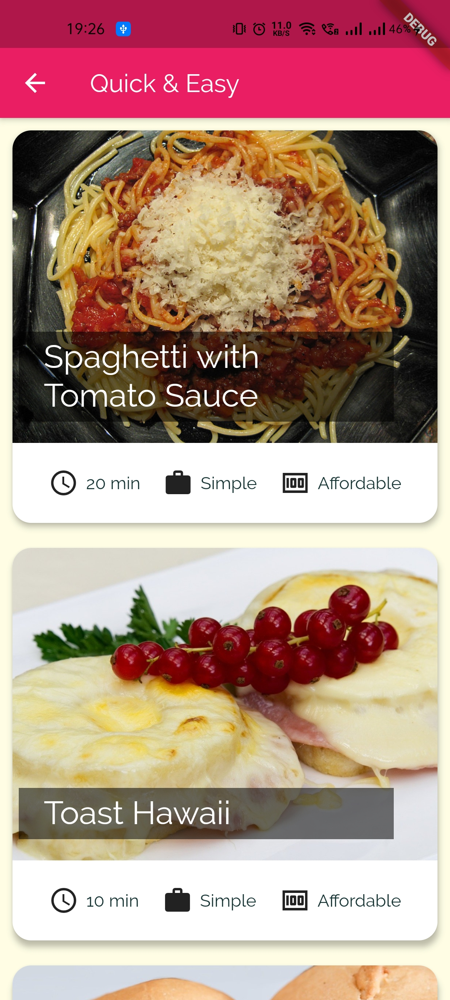
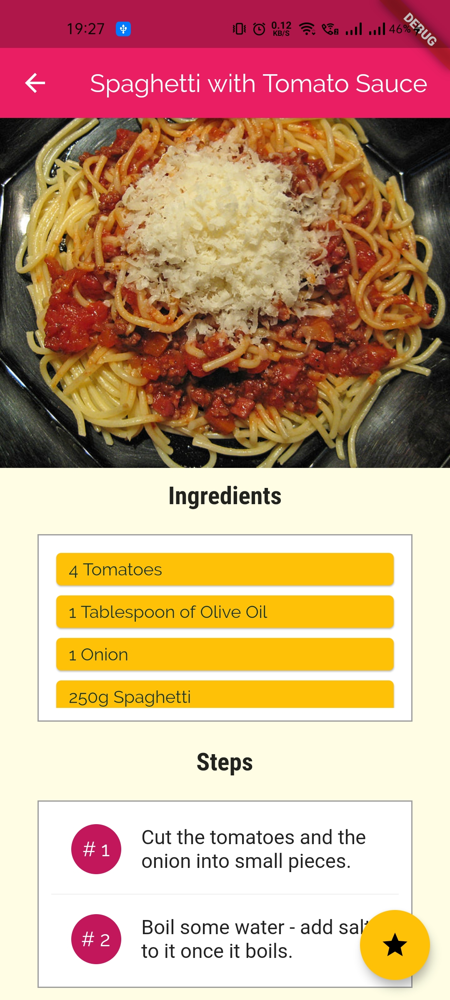
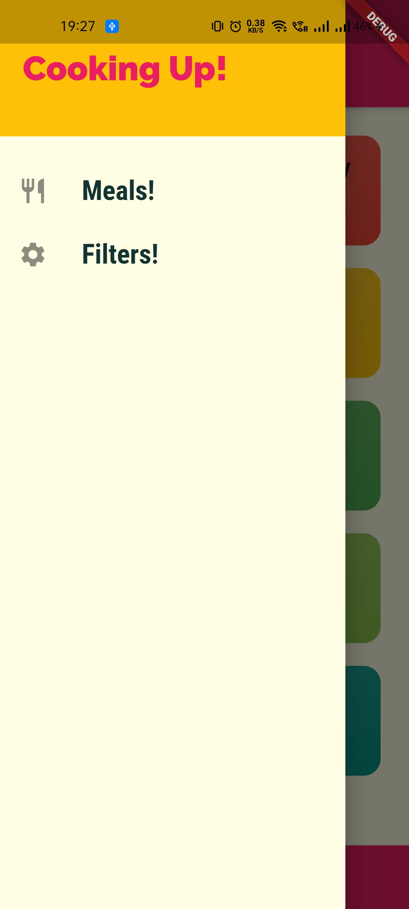
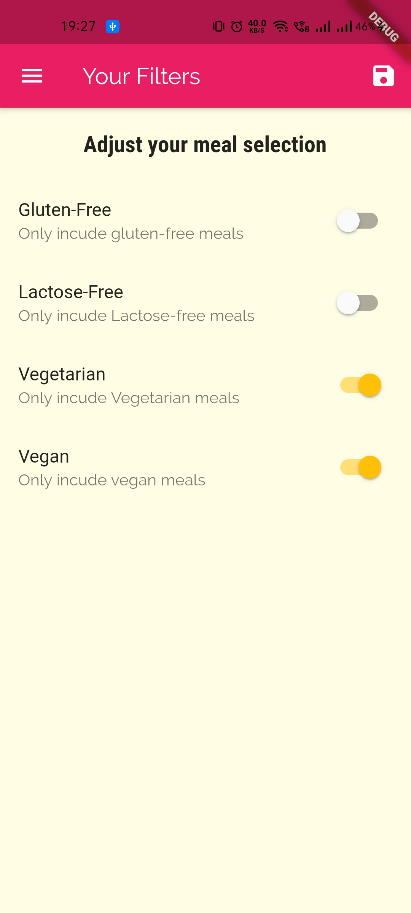

# mealsApp

- This is a demo mobile Application which displays all the meals/recipes that we manually add in it.

- I created this app just for education purpose to sharpen my UI/UX design skills as I learned about a lot of widgets related to designing which I was not familiar with. 

- It displays the picture of the meal with its name, ingredients and recipe.

- It has features like adding as favorite and filtering the recipes to see only those recipes which fit our criteria.

## Images

#### Categories Screen

#### Category detail Screen

#### Meal Desciption Screen

#### Favorites Screen

#### Appbar

#### Filters Screen
